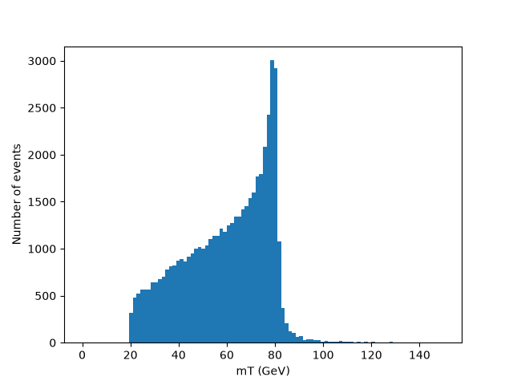

## w-boson-mass-analysis
The study recreates the core analysis method of the UA1 experiment, which earned 1984 Nobel Prize in Physics. With the simulation and analysis; W boson is observed, and its mass is determined.

*Since this analysis is based on parton-level Monte Carlo simulations, detector effects are excluded. In a real detector, the transverse momentum of neutrino is not directly measurable and has to be calculated using missing transverse energy. However in this simulation, it is read directly from the LHE output.(Calculations with MET will be included in the further updates)*
### Simulation
Generated 50.000 events of p p → μ⁺ $ν_μ$ using MadGraph5.

(In the process, intermediate particle is the W boson.)
### Analysis
While in processes such as Z → μ⁺ μ⁻, invariant mass can be calculated easily, (for further info, visit my other repo. 'muon-sm-llp-analysis') in current process, since the neutrino leaves no trace in the detector, $p_z$ of the neutrino is unknown. Therefore, the classical invariant mass formula cannot be used.

Instead the transverse mass mT is calculated, avoiding the unknown $p_z$ .

$$
M_T^2 = 2|\boldsymbol{p}_T(μ)||\boldsymbol{p}_T(μ)|(1 - \cos\phi_{μν}) 
$$

$\phi_{μν}$ is the angle between ${p}_T(μ)$ and ${p}_T(ν)$

Since the transverse mass must be less than or equal to the true mass, the maximum value points out the true mass, and must fall steeply to zero at the exact value of true mass.

### Histogram & Result

The Jacobian peak is at approximately 80 GeV, which indicates that W boson mass is around 80 GeV. (This aligns with the PDG value of W boson mass, 80.376 ± 0.033 GeV)

### How to Reproduce
 1) Install MadGraph5_aMC@NLO and Python with pylhe and matplotlib.
 2) Apply the following steps:

       mg5_aMC> generate p p > mu+ vm

       output pp_muvm

       launch
     
       (as mentioned, 50.000 events are simulated in this study, you may specify the number of events as desired. Higher number of events result in more applicable data.)
  4) The LHE file generated will be the path you will point as 'file' in 'analysis.py'.
  5) Run 'analysis.py' in Python.

### References
[1] Arnison, G., et al. (UA1 Collaboration) "Experimental observation of isolated large transverse energy electrons with associated missing energy at √s= 540 GeV." Physics Letters B 122.1 (1983): 103-116.
[2] Jackson, J. D. and D.R. Tovey, "38. Kinematics" Review of Particle Physics, Particle Data Group (2008), Section 38. (pdg.lbl.gov/2008/reviews/kinemarpp.pdf)
[3] Zyla P.A. et al. (Particle Data Group), Prog. Theor. Exp. Phys. 2020, 083C01 (2020), W Boson Mass. (pdg.web.cern.ch/pdg/2020/listings/rpp2020-list-w-boson.pdf)
